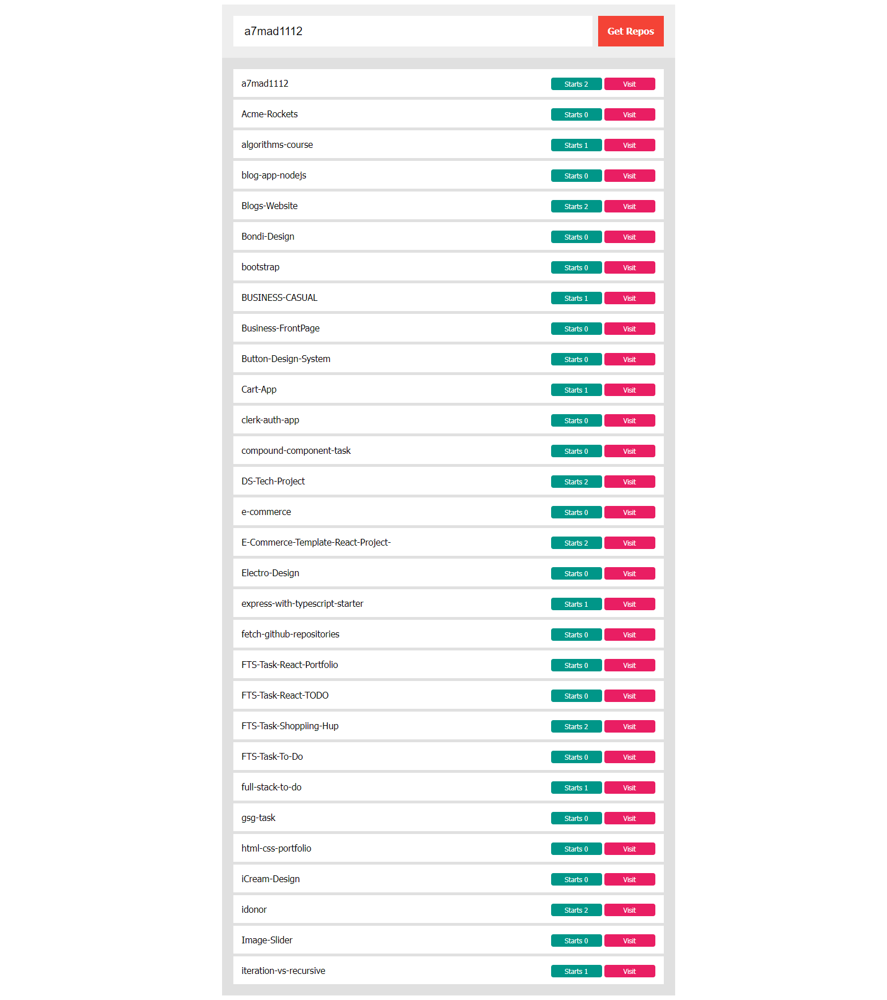

# Fetch GitHub Repositories App
## Overview
Fetch GitHub Repositories is a JavaScript application designed for efficient retrieval of GitHub repositories based on user input. The app employs memoization to enhance performance, ensuring swift responses for repeated requests.

## Features
- **GitHub Repo** Retrieval: Input a GitHub username to get a list of associated repositories.

- **Memoization**: Caches previously fetched data, reducing response times for repeated queries.

## How to Use
- Enter a GitHub username.

- Click "Fetch Repositories."

- Quickly view the repositories associated with the provided username.

## Benefits
- **Improved Performance**: Swift responses, especially for previously fetched usernames.

- **Enhanced User Experience**: Minimal wait times, delivering a responsive application.

## Technical Details
Built with JavaScript, utilizing the Fetch API for GitHub interactions, and implementing memoization for efficient data management.

Explore, contribute, and enjoy the streamlined GitHub repository fetching with this application! 🚀🔍

